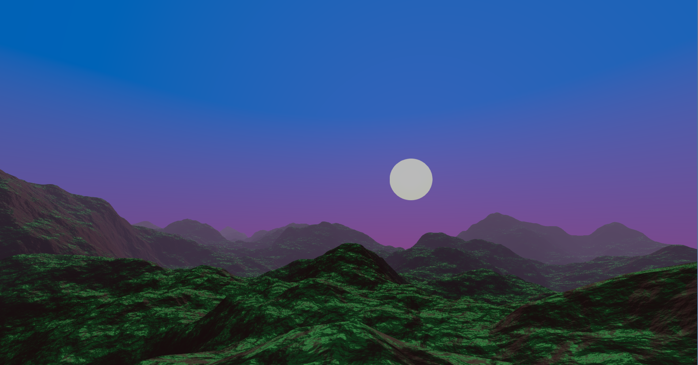
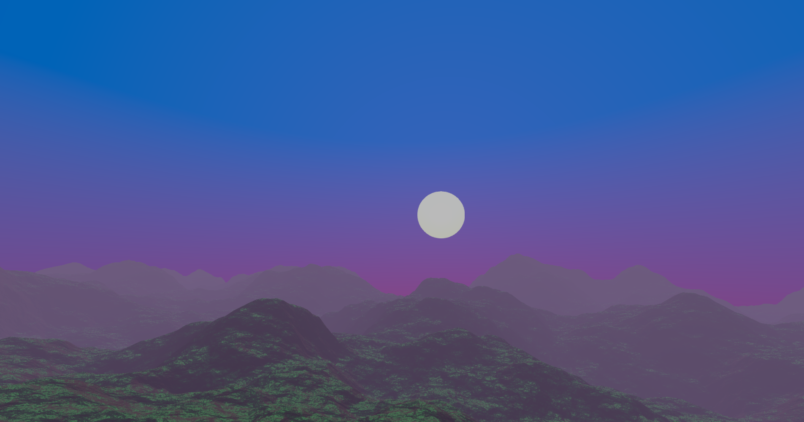

# Godot Terrain Generator

Made by Acerola, 
Altered by Eber 

Implements simple perlin noise based fractional brownian motion as a Godot compositor effect for use as a base or reference in my event [Dirt Jam](https://itch.io/jam/acerola-dirt-jam/).

## Modifications List:
- **Importable Shader Files**; 
- **Fog**:
	- Linear fog made on the fragment shader:

	- Exponential fog woth density of 1.0 and max distance of 700:

- **Specular Highlights**:
	-  The lighting model used was Blinn-Phong for a better approximation of lighting, based on *learnopengl*'s chapter about it, available on: [Advanced Lighting](https://learnopengl.com/Advanced-Lighting/Advanced-Lighting).

## TODO: detail how the items are made
