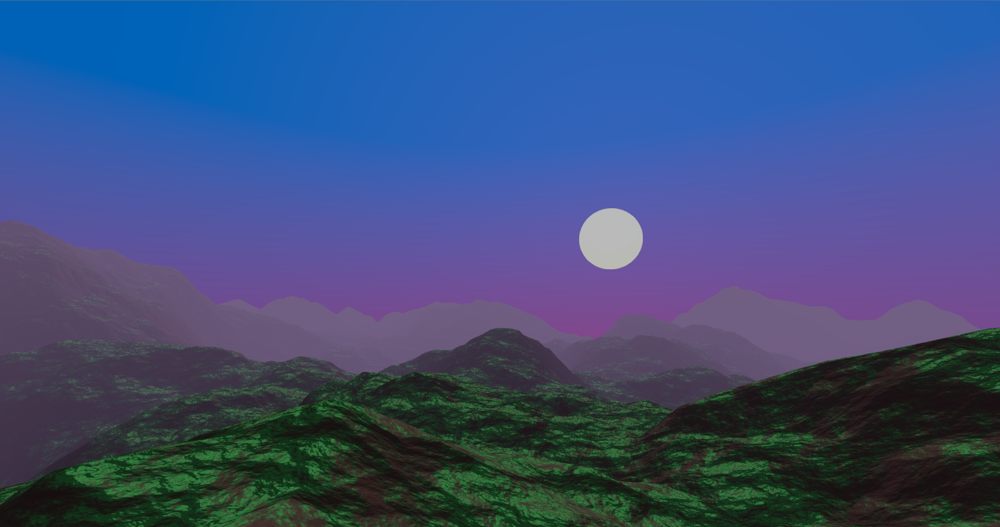

# Godot Terrain Generator

Made by Acerola, 
Altered by Eber 

Implements simple perlin noise based fractional brownian motion as a Godot compositor effect for use as a base or reference in my event [Dirt Jam](https://itch.io/jam/acerola-dirt-jam/).

## Modifications List:
- **Importable Shader Files**; 
- **Fog**:
	- All the fog applied here were done on the Fragment Shader and come from [OGLDEV](https://www.youtube.com/@OGLDEV)'s videos on the Topic;
		- [Part 1](https://www.youtube.com/watch?v=oQksg57qsRA)
		- [Part 2](https://www.youtube.com/watch?v=BYbIs1C7rkM)
	- **Linear Fog**:

	- **Exponential Fog**:

	- **Exponential Squared Fog**:

- **Specular Highlights**:
	-  The lighting model used was Blinn-Phong for a better approximation of lighting, based on *learnopengl*'s chapter about it, available on: [Advanced Lighting](https://learnopengl.com/Advanced-Lighting/Advanced-Lighting).

## TODO: detail how the items are made
